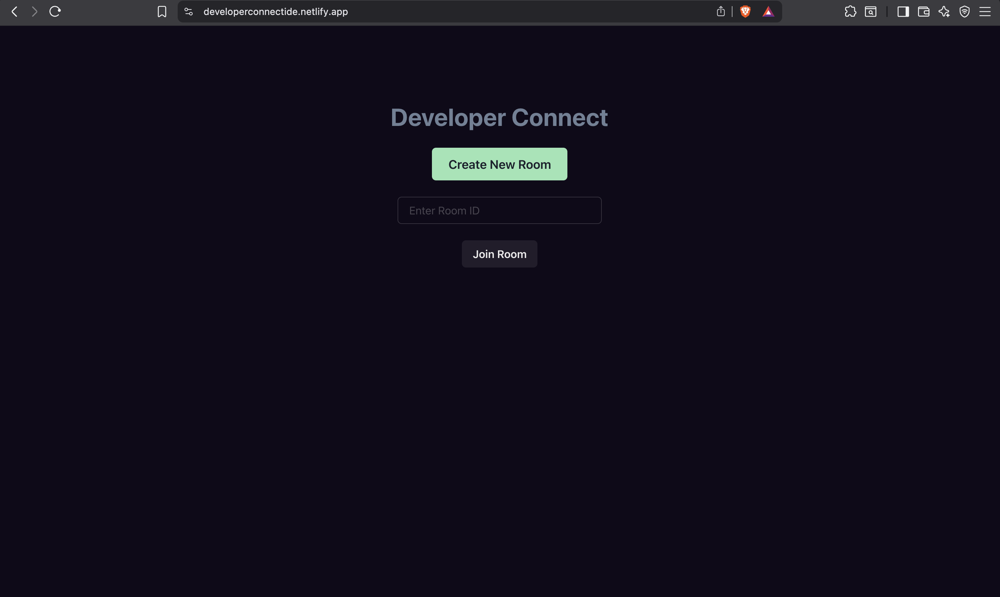
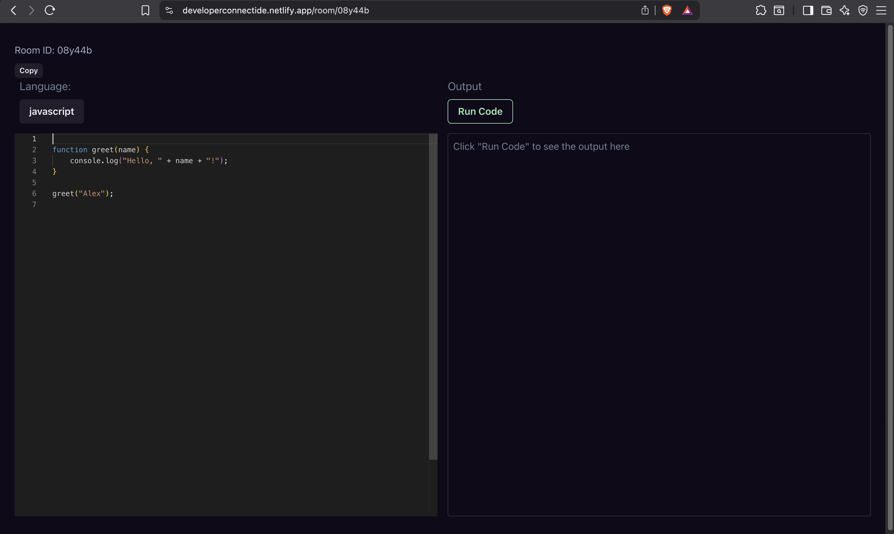
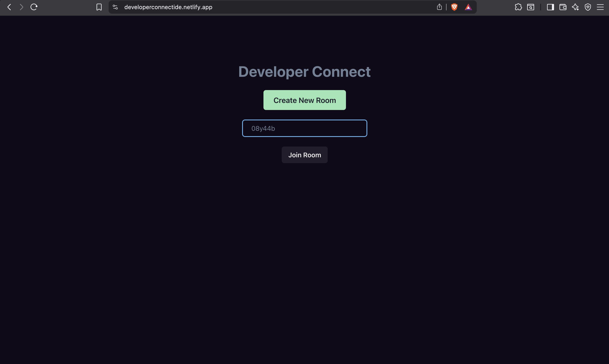
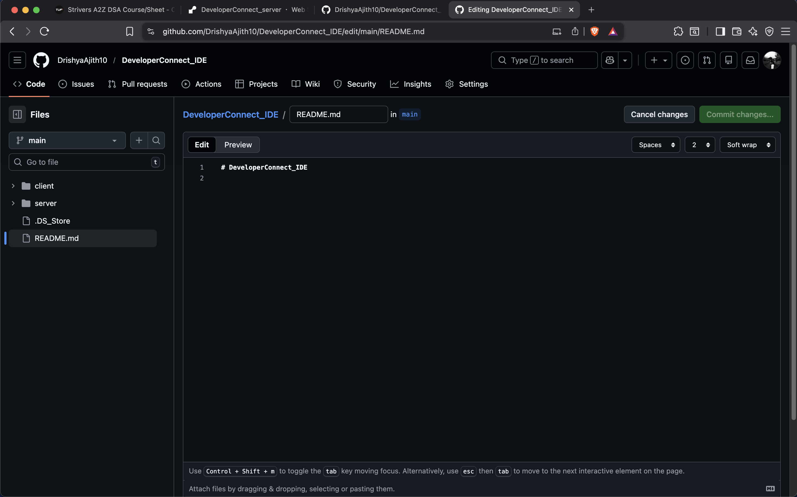

# 🚀 Developer Connect  
### Real-Time Collaborative Web IDE

---

## 📌 Project Description

Developer Connect is a browser-based real-time collaborative coding platform built using **React**, **Node.js**, and **Socket.io**.

The platform allows multiple users to join a shared room and collaborate inside a synchronized coding environment. Users can:

- Join a common collaboration room  
- Edit code simultaneously  
- Receive live code updates instantly  
- Communicate through an integrated chat system  

Real-time synchronization is powered by **WebSocket-based communication** using Socket.io, ensuring low-latency, event-driven updates between connected clients.

The core objective of this project is to demonstrate real-time, multi-user collaboration within a web-based IDE environment.

---

## 🛠 Tech Stack

### Frontend
- React  

### Backend
- Node.js  

### Real-Time Communication
- Socket.io  

### Deployment
- Netlify (Frontend)  
- Render (Backend)  

---

## 🚀 Features

- Real-time collaborative code editor  
- Multi-user room system  
- Live code synchronization  
- Integrated real-time chat  
- WebSocket-based event communication  

---

**Flow:**  
Frontend → Backend  
      ↘ Socket.io  

---

## 🌐 Live Deployment

Live Link: https://developerconnectide.netlify.app/

## Image





## 📦 Installation

### Clone Repository

```bash
git clone https://github.com/<your-username>/<repo-name>.git
cd <repo-name>
